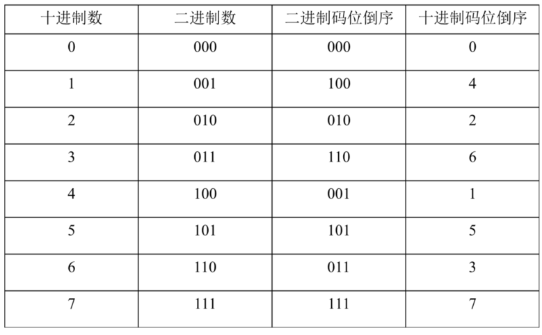

<!-- page_number: true -->
<!--$theme: gaia-->

　
# 遥感数字图像处理实验课
## - 2 图像傅里叶变换与快速傅里叶变换
  
崔家梁
(cuijialiang@pku.edu.cn)  

---
# 关于本讲义
如果你在github上查看不了公式,建议使用chrome浏览器的GitHub with MathJax插件  
https://chrome.google.com/webstore/detail/github-with-mathjax/ioemnmodlmafdkllaclgeombjnmnbima?hl=en

---
# 相关概念
- 欧拉公式
$$e^{ix} = cosx+isinx$$  
两点需要注意的:
- 1-它的实部是关于0点对称
- 2-它是$2\pi$周期的

---
### Baron Jean Baptiste Joseph Fourier['furiei]
  
男爵,法国数学家,物理学家;1768-1830

---

## 连续傅里叶变换(FT)
###### 法语：Transformation de Fourier
###### 英语：Fourier transform
$f(x)$代表原函数即时域,$\hat{f}(\xi)$代表变换后的函数即频域
一维傅里叶变换
$$\scriptsize \hat{f}(\xi) = \int_{-\infty}^{\infty}f(x)e^{-2\pi i x \xi}dx, \xi \in R$$
其逆变换
$$\scriptsize f(x) = \int_{-\infty}^{\infty}\hat{f}(\xi)e^{2\pi i \xi x}d\xi, x \in R$$

---

$\hat{f}(\xi)$代表函数$f(x)$在频率$\xi$上的特征
要注意的是,在图像处理中**时域通常为空间维度**

---
# 离散傅里叶变换(DFT)
对于位于时域的$N$点序列$\{x[n] \}_{0\le n < N}$,它的DFT为:

$\hat{x}[k] = \sum_{n=0}^{N-1} e^{-i \frac{2\pi}{N} nk}x[n], k=0,1,...,N-1$

通常记为$\hat{x} = \mathcal{F} x$

其逆变换(IDFT)为:

$x[n] = \frac{1}{N}\sum_{k=0}^{N-1} e^{i \frac{2\pi}{N} nk}\hat{x}[k], n=0,1,...,N-1$

可以记为$x=\mathcal{F}^{-1}\hat{x}$

---
## 离散傅里叶变换(DFT)-接上页
对于DFT这个看起来有那么一丢丢复杂的公式:  
$\hat{x}[k] = \sum_{n=0}^{N-1} e^{-i \frac{2\pi}{N} nk}x[n], k=0,1,...,N-1$

其实,其中的$e^{-i \frac{2\pi}{N} nk}$,记$\small W_N^{nk}=e^{-i \frac{2\pi}{N} nk}=cos(\frac{2\pi}{N} nk)+isin(\frac{2\pi}{N} nk)$  
### 与$x[n]$并没有任何卵关系

所以上面那个公式可以写成:  
$\hat{x}[k] = \sum_{n=0}^{N-1} W_N^{nk} x[n],k=0,1,...,N-1$

---
## 离散傅里叶变换(DFT)-接上页
因此对于DFT变换有  
$$\tiny \begin{bmatrix} \hat{x}[0] \\\ \hat{x}[1] \\\ \vdots \\\ \hat{x}[N-1]\end{bmatrix}=
\begin{bmatrix} W_N^{0} & W_N^{0 * 1} & \cdots & W_N^{0 * (N-1)}
\\\ W_N^{1 * 0} & W_N^{1 * 1} & \cdots & W_N^{1 * (N-1)}
\\\ \vdots & \vdots & \ddots & \vdots
\\\ W_N^{(N-1) * 0} & W_N^{(N-1) * 1} & \cdots & W_N^{(N-1) * (N-1)}
\end{bmatrix}
\begin{bmatrix} x[0] \\\ x[1] \\\ \vdots \\\ x[N-1]\end{bmatrix}$$

上面这个算式的计算复杂度是$O(N^2)$

需要注意的是,计算得到的$x$序列式一个复数序列.

---
## 快速傅里叶变换(FFT)
对于$\small W_N^{nk}=e^{-i \frac{2\pi}{N} nk}$,记$nk=t$,即$\small W_N^{t}=e^{-i \frac{2\pi}{N} t}=cos(2\pi\frac{t}{N})$  

由于有$cos(x) = cos(2p\pi \pm x),p \in Z$,因此有:  
$$W_N^{t}=W_N^{pN \pm t}=-W_N^{N/2+pN \pm t}, p \in Z$$
因此，对于4*4的$W$矩阵,有:  
$$\scriptsize
\begin{bmatrix}
W^0_4 & W^0_4 & W^0_4 & W^0_4
\\\ W^0_4 & W^1_4 & W^2_4 & W^3_4
\\\ W^0_4 & W^2_4 & W^4_4 & W^6_4
\\\ W^0_4 & W^3_4 & W^6_4 & W^9_4
\end{bmatrix}
=\begin{bmatrix}
W^0_4 & W^0_4 & W^0_4 & W^0_4
\\\ W^0_4 & W^1_4 & -W^0_4 & -W^1_4
\\\ W^0_4 & -W^0_4 & W^0_4 & -W^0_4
\\\ W^0_4 & -W^1_4 & -W^0_4 & W^1_4
\end{bmatrix}
$$

---
# FFT-以N=8为例
将$x[n]$分为两个序列  
$\scriptsize\hat{x}[k] = \sum_{n=0}^{N-1} W_N^{nk} x[n]$  
$\scriptsize=\sum_{n=0,2,4,6} W_N^{nk} x[n] +\sum_{n =1,3,5,7} W_N^{nk}x[n]$  
$\scriptsize= \sum_{n=0}^{N/2-1} W_N^{2nk} x[2n] + \sum_{n=0}^{N/2-1} W_N^{(2n+1)k} x[2n+1]$  
$\scriptsize= \sum_{n=0}^{N/2-1} W_{N/2}^{nk} x[2n] + W_N^k\sum_{n=0}^{N/2-1} W_{N/2}^{nk} x[2n+1]$  
$\scriptsize= g[k]+W^k_N h[k]$  

其中,  
$\scriptsize g[k]=\sum_{n=0}^{N/2-1} W_{N/2}^{nk} x[2n]$,是$\scriptsize x[n]$偶数点组成序列的DFT,  
$\scriptsize h[k]=\sum_{n=0}^{N/2-1} W_{N/2}^{nk} x[2n+1]$,是$\scriptsize x[n]$奇数点组成序列的DFT

---
# FFT-以N=8为例-接上
有$g[m+4]=g[m],h[m+4]=h[m]$,则

$${\begin{matrix}
 \hat{x}[0]=g[0]+W^0_8h[0] = g[0]+W^0_8h[0]\\\ 
\hat{x}[1]=g[1]+W^1_8h[1] = g[1]+W^1_8h[1]\\\ 
\hat{x}[2]=g[2]+W^2_8h[2] = g[2]+W^2_8h[2]\\\ 
\hat{x}[3]=g[3]+W^3_8h[3] = g[3]+W^3_8h[3]\\\ 
\hat{x}[4]=g[4]+W^4_8h[4] = g[0]-W^0_8h[0]\\\ 
\hat{x}[5]=g[5]+W^5_8h[5] = g[1]-W^1_8h[1]\\\ 
\hat{x}[6]=g[6]+W^6_8h[6] = g[2]-W^2_8h[2]\\\ 
\hat{x}[7]=g[7]+W^7_8h[7] = g[3]-W^3_8h[3]
\end{matrix}}$$

---
# FFT-以N=8为例-接上

---
### FFT-以N=8为例-接上
则N=8的FFT完整架构如下
  
该算法称为【蝶形算法】,复杂度为$O(Nlog(N))$

---
# FFT-码序倒位

---
# FFT-总结  
- 找到DFT对称的联系,降低复杂度.  
- 只适用于N是2的整数次幂的情况,如果不是,GG...

---
### 二维DFT
$F(u,v) = \sum_{x=0}^{N-1} \sum_{y=0}^{M-1} e^{-i 2\pi (\frac{ux}{N}+\frac{vy}{M})}f(x,y)$

### 二维IDFT
$f(x,y) = \dfrac{1}{MN} \sum_{u=0}^{N-1} \sum_{v=0}^{M-1} e^{i 2\pi (\frac{ux}{N}+\frac{vy}{M})}F(u,v)$

---
### 二维DFT-分离性
$F(u,v) = \sum_{x=0}^{N-1} \sum_{y=0}^{M-1} e^{-i 2\pi (\frac{ux}
{N}+\frac{vy}{M})}f(x,y)$
1.先按$x$所在维度展开
$F'(u,y) = \sum_{x=0}^{N-1} e^{-i 2\pi (\frac{ux}{N})}f(x,y)$
2.再展开$y$所在维度
$F(u,v)=\sum_{y=0}^{M-1} e^{-i 2\pi (\frac{vy}{M})}F'(u,y)$

---
### 频谱原点移动
在数字图像处理中,通常将傅里叶变换频谱原点移动到图片的中心,以便能清楚地分析傅里叶变换的情况

- 一维情况,以$k_0$为新的原点移动图像
$$\scriptsize {\hat{x}}_{c=k_0}[k]={\hat{x}}[k-k_0] = \sum_{n=0}^{N-1} e^{-i \frac{2\pi}{N} n(k-k_0)}x[n]$$

- **逆变换与二维情况请自行推导!**

---
# 这东西到底有什么卵用？

---
# 作业2-傅里叶变换
#### 编程实现以下内容:
- 打开一张**黑白**图片(大小合适^_^);  
- 实现DFT与IDFT;  
- 实现FFT与IFFT;  
- DFT,IDFT,FFT,IFFT算法均需要各位自己实现,不可调用现有运算库.  
 
请于2017年10月31日北京时间上午10点之前提交至 cuijialiang@pku.edu.cn,收到回复为准.

---
# References  
- wikipedia.org 傅里叶变换 离散傅里叶变换 快速傅里叶变换 等词条.